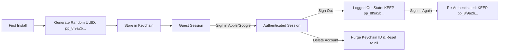
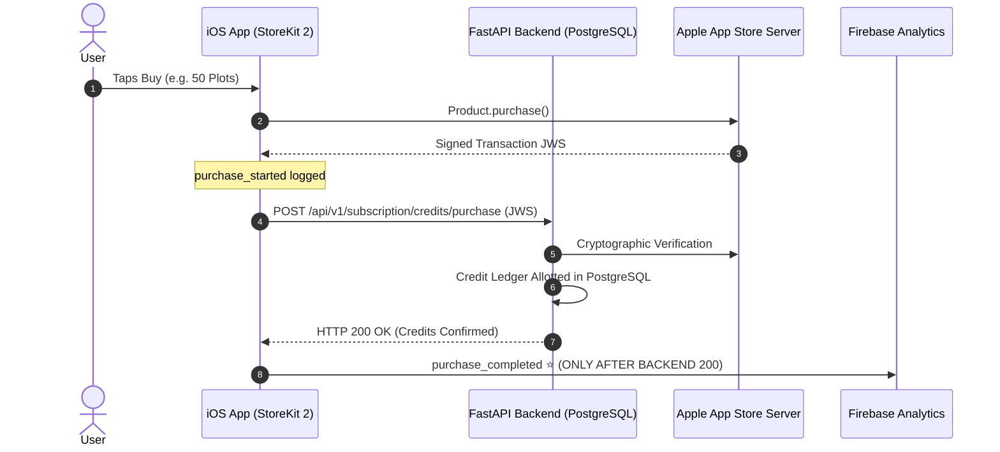

# Bhumitra / Prettyplot Production Product Analytics & Crash Monitoring Specification (v2.1)

---

## 1. Executive Summary & Core Objectives

This specification defines the product analytics, telemetry, and crash monitoring architecture for the Bhumitra / Prettyplot iOS application.

The analytics system is designed to provide clear, high-signal answers to 10 foundational questions:
1. **Are users opening the app?** (DAU, WAU, MAU, Session frequency)
2. **Are new users becoming activated?** (Activation Rate on Day 0 / Day 1)
3. **Are users successfully finding land records?** (Search Success Rate, Verified Records Rendered)
4. **Where are users dropping in the search funnel?** (Search start $\rightarrow$ submit $\rightarrow$ backend response $\rightarrow$ UI render)
5. **What parts of the product are actually used?** (Map vector tap vs manual dropdown, area converter, tenant shares, PDF exports)
6. **Do users return?** (D1, D7, D30 cohort retention)
7. **When and why do users reach the paywall?** (Credit exhaustion, low credit warnings, feature locks, manual visits)
8. **Which products convert?** (Consumable packs 10/50/200 vs Monthly unlimited)
9. **Why do purchases fail?** (StoreKit cancellation, payment decline, backend validation timeout)
10. **Which backend/search problems are hurting the product?** (Bhulekh timeouts, GIS code mismatches, rate limits, unverified parcels)

---

## 2. Core Product Activation & Engagement Definitions

| Attribute | Specification |
| :--- | :--- |
| **Activation Event** | `land_record_successfully_viewed` (fired on the user's first occurrence) |
| **Activation Definition** | A new user is considered **Activated** when they initiate a land search (via map tap or manual search) and the application successfully renders the verified official land record (Plot, Khatian, Area, Kisam, Owners) on their screen. |
| **Activation Window** | **24 Hours (Day 0 / Day 1)** from first app open. |
| **Activation Rate** | $\text{Activation Rate} = \frac{\text{Count of New Users with } \ge 1 \text{ } \texttt{land\_record\_successfully\_viewed} \text{ within 24h}}{\text{Total New Users installed in cohort}} \times 100$ |
| **Successful Records per Activated User** | $\text{Records per Activated User} = \frac{\text{Total } \texttt{land\_record\_successfully\_viewed}}{\text{Total Activated Users in cohort}}$ |
| **Record View Rate** | $\text{Record View Rate} = \frac{\text{Total } \texttt{land\_record\_successfully\_viewed}}{\text{Total } \texttt{land\_search\_succeeded}} \times 100$ *(Measures UI rendering reliability after backend success)* |

> [!IMPORTANT]
> Merely opening the search bar or tapping "Search" does **NOT** constitute activation. Activation requires the user to experience the core value proposition: viewing their verified land record.

---

## 3. Privacy Rules & Data Protection

### 🚫 STRICTLY FORBIDDEN (Never Dispatched to Firebase or Crashlytics):
- **Citizen & Ownership PII**: Full Name, Tenant / Owner names, Father/Spouse names, Phone numbers, Email addresses, exact land boundary coordinates.
- **Cadastral Numbers**: Exact Plot Number, Khata / Khatian Number.
- **Raw Payloads**: Raw RoR response JSON, Raw PDF binary bytes, Raw HTML scraped pages.
- **Auth Secrets**: Apple Identity Token, Google ID Token, Apple Authorization Code, Bhumitra JWT Bearer Token, App Account Token.
- **StoreKit Raw Financials**: Apple Transaction ID, StoreKit Signed JWS transaction payload, receipt data.

### ✅ PERMITTED OPERATIONAL METADATA:
- `district_id` (e.g. `224` for Keonjhar)
- `tehsil_id` (e.g. `12` or `KEONJHAR_SADAR`)
- `search_method` (`map_tap`, `dropdown_manual`, `unique_id`, `khata_search`)
- `result_status` (`verified_private`, `verified_government`, `not_found`, `error`)
- `is_government_land` (`true`, `false`)
- `owner_count` (Integer: e.g. `1`, `3`, `12`)
- `land_classification` (`agricultural`, `gharabari`, `orchard`, `water_body`, `other`)
- `latency_ms` (Integer rounded milliseconds)
- `cache_hit` (`true`, `false`)
- `remaining_credit_bucket` (`0`, `1-3`, `4-10`, `11-50`, `50+`)
- `error_category` (Controlled Enum: `cancelled`, `network`, `provider_error`, `configuration`, `backend_error`, `invalid_token`, `timeout`, `upstream_error`, `parse_error`, `unknown`)

---

## 4. Controlled Error Categories (Enums Only)

To prevent noise and maintain dashboard hygiene, arbitrary error strings are strictly prohibited. All error reporting uses controlled enums:

| Error Category | Technical Meaning | Typical Context |
| :--- | :--- | :--- |
| `cancelled` | User voluntarily cancelled the action | Apple Sign-In cancelled, Apple Pay cancelled |
| `network` | Offline, socket disconnected, DNS failure | Offline device during search or fetch |
| `provider_error` | External auth/payment provider rejection | Google Sign-In SDK error, StoreKit billing error |
| `configuration` | Missing client configuration or plist | Invalid URL scheme, missing bundle config |
| `backend_error` | Backend returned HTTP 500, 502, or 503 | Server crash, DB connection failure |
| `invalid_token` | JWT or auth token expired or invalid | Session expired, token refresh required |
| `timeout` | Request exceeded timeout window (e.g. 15s) | Slow 3G network or upstream hanging |
| `upstream_error` | Upstream land registry (Bhulekh) error | Bhulekh Odisha portal downtime / 502 |
| `parse_error` | JSON or HTML decoding exception | Schema mismatch or unexpected response body |
| `unknown` | Unclassified generic fallback error | Fallback only |

---

## 5. Analytics User ID Lifecycle (Continuous Across Auth & Logout)

To ensure retention metrics and multi-touch user journeys remain continuous, **the opaque analytics ID is NOT regenerated on logout**.



### Lifecycle Rules:
1. **Generation**: On first launch, generate an opaque UUID v4 with a `pp_` prefix (e.g. `pp_7c3a9e2f418a4d7fb9e2110c9a876123`).
2. **Storage**: Stored in the device Keychain (`bhumitra_analytics_user_id`) so it survives app reinstalls, updates, and session changes.
3. **Continuity**: The same `pp_UUID` survives:
   - First install $\rightarrow$ Guest session $\rightarrow$ Apple login $\rightarrow$ Google login $\rightarrow$ Logout $\rightarrow$ Login again.
4. **Account Deletion**: ONLY when the user explicitly deletes their account or requests a data purge in settings, the Keychain ID is deleted, `Analytics.setUserID(nil)` is called, and a new random ID is generated for future usage.

---

## 6. Record Events & Distinction

To avoid redundant double-tracking while maintaining visibility into rendering:

```
┌─────────────────────────────────────────────────────────────┐
│ 1. land_search_succeeded                                    │
│    -> Triggered when the backend API successfully returns   │
│       verified RoR data over the network (HTTP 200 payload).│
└──────────────────────────────┬──────────────────────────────┘
                               │
                               ▼
┌─────────────────────────────────────────────────────────────┐
│ 2. land_record_viewed                                       │
│    -> Triggered when the bottom cadastral card/sheet        │
│       presents on screen (includes unverified/shimmer state)│
└──────────────────────────────┬──────────────────────────────┘
                               │
                               ▼
┌─────────────────────────────────────────────────────────────┐
│ 3. land_record_successfully_viewed ⭐ [ACTIVATION KPI]       │
│    -> Triggered ONLY when verified ownership & area fields  │
│       are fully rendered and clearly visible to the user.   │
└─────────────────────────────────────────────────────────────┘
```

- **`Record View Rate`** = `land_record_successfully_viewed / land_search_succeeded`: Identifies UI rendering drop-offs or client layout crashes following a successful network response.

---

## 7. Revenue Source of Truth Architecture



> [!CRITICAL]
> `purchase_completed` **MUST ONLY** fire after backend server verification confirms the transaction and grants the entitlement. Firebase Analytics is a passive conversion tracker, **never** the revenue ledger.

---

## 8. Primary Conversion Funnels

```mermaid
flowchart TD
    subgraph Funnel_1 [1. Onboarding & Activation Funnel]
        F1_1[first_open] --> F1_2[auth_screen_viewed / guest_session_started]
        F1_2 --> F1_3[land_search_started]
        F1_3 --> F1_4[land_record_successfully_viewed ⭐ ACTIVATION]
    end

    subgraph Funnel_2 [2. Core Search & Verification Funnel]
        F2_1[land_search_started] --> F2_2[land_search_submitted]
        F2_2 --> F2_3[land_search_succeeded]
        F2_3 --> F2_4[land_record_successfully_viewed]
    end

    subgraph Funnel_3 [3. Monetization Funnel]
        F3_1[paywall_viewed] --> F3_2[product_selected]
        F3_2 --> F3_3[purchase_started]
        F3_3 --> F3_4[purchase_completed ⭐ SERVER CONFIRMED]
    end

    subgraph Funnel_4 [4. Report & Export Funnel]
        F4_1[land_record_successfully_viewed] --> F4_2[land_passport_viewed]
        F4_2 --> F4_3[official_ror_download_started]
        F4_3 --> F4_4[official_ror_download_completed]
        F4_4 --> F4_5[bhumitra_report_shared]
    end
```



---

## 9. Core Business KPIs

| # | Metric Name | Definition & Formula | Target / Purpose |
|---|:---|:---|:---|
| 1 | **DAU / WAU / MAU** | Count of unique active users per day, 7-day rolling, and 30-day rolling window. | Active growth tracking |
| 2 | **New Users** | Count of unique users firing `first_open`. | Acquisition volume |
| 3 | **Activation Rate** | $\frac{\text{New users with } \ge 1 \text{ } \texttt{land\_record\_successfully\_viewed} \text{ within 24h}}{\text{Total cohort new users}} \times 100$ | $> 65\%$ (Core Activation) |
| 4 | **Successful Records per Activated User** | $\frac{\text{Total } \texttt{land\_record\_successfully\_viewed}}{\text{Total Activated Users in cohort}}$ | Measures usage depth |
| 5 | **Record View Rate** | $\frac{\text{Total } \texttt{land\_record\_successfully\_viewed}}{\text{Total } \texttt{land\_search\_succeeded}} \times 100$ | UI rendering reliability |
| 6 | **D1 Retention** | $\%$ of new users returning on Day 1 after install. | $> 35\%$ |
| 7 | **D7 Retention** | $\%$ of new users returning on Day 7 after install. | $> 20\%$ |
| 8 | **D30 Retention** | $\%$ of new users returning on Day 30 after install. | $> 12\%$ |
| 9 | **Searches per Active User** | $\frac{\text{Total } \texttt{land\_search\_started}}{\text{Active Users in period}}$ | Engagement intensity |
| 10 | **Search Success Rate** | $\frac{\text{Total } \texttt{land\_search\_succeeded}}{\text{Total } \texttt{land\_search\_submitted}} \times 100$ | $> 90\%$ |
| 11 | **Paywall View Rate** | $\frac{\text{Users who fired } \texttt{paywall\_viewed}}{\text{Total Active Users}} \times 100$ | Paywall reach |
| 12 | **Purchase Conversion Rate** | $\frac{\text{Users who fired } \texttt{purchase\_completed}}{\text{Users who fired } \texttt{paywall\_viewed}} \times 100$ | $> 5.0\%$ |
| 13 | **Revenue per Active User (ARPU)**| $\frac{\text{Total Gross Revenue from purchases}}{\text{Total Active Users}}$ | Monetization efficiency |
| 14 | **Average Revenue per Paying User (ARPPU)**| $\frac{\text{Total Gross Revenue}}{\text{Unique Paying Users}}$ | Tier selection value |
| 15 | **Credit Exhaustion Rate** | $\frac{\text{Users who fired } \texttt{credits\_exhausted}}{\text{Total Active Users}} \times 100$ | Free-to-paid pressure |
| 16 | **PDF Export Rate** | $\frac{\text{Total } \texttt{official\_ror\_download\_completed}}{\text{Total } \texttt{land\_record\_successfully\_viewed}} \times 100$ | Formal document utility |

---

## 10. Final Consolidated Event Taxonomy (31 High-Signal Events)

### Group A: Authentication & Onboarding (7 Events)
1. **`auth_screen_viewed`**: `trigger_source` (`map_gate`, `card_gate`, `profile_tab`, `paywall`)
2. **`login_started`**: `provider` (`apple`, `google`)
3. **`login_completed`**: `provider` (`apple`, `google`), `is_new_user` (`true`, `false`)
4. **`login_failed`**: `provider` (`apple`, `google`), `error_category` (`cancelled`, `network`, `provider_error`, `invalid_token`, `backend_error`, `unknown`)
5. **`guest_session_started`**: `trigger_source` (`onboarding`, `dismiss_login`)
6. **`account_link_started` / `account_link_completed`**: `provider` (`apple`, `google`)
7. **`logout_completed`**: `previous_provider` (`apple`, `google`)

### Group B: Land Search & Verification Funnel (6 Events)
8. **`land_search_started`**: `search_method` (`map_tap`, `dropdown_manual`, `unique_id`, `khata_search`), `district_id`, `tehsil_id`
9. **`land_search_submitted`**: `search_method`, `district_id`, `tehsil_id`
10. **`land_search_succeeded`**: `search_method`, `district_id`, `tehsil_id`, `result_status` (`verified_private`, `verified_government`), `latency_ms`, `cache_hit`, `is_government_land`
11. **`land_search_failed`**: `search_method`, `district_id`, `latency_ms`, `error_category` (`timeout`, `network`, `backend_error`, `upstream_error`, `parse_error`, `unknown`)
12. **`land_search_empty`**: `search_method`, `district_id`, `tehsil_id`
13. **`land_record_successfully_viewed`** ⭐ [ACTIVATION & SUCCESS KPI]: `district_id`, `is_government_land`, `owner_count`, `land_classification`

### Group C: Land Record & Detailed Interactions (2 Events)
14. **`land_record_viewed`**: `district_id`, `is_government_land`, `owner_count`, `land_classification`
15. **`land_record_action`**: `action` (`owner_details`, `extent`, `classification`, `associated_plots`, `official_ror`, `share`, `save`), `district_id`

### Group D: Land Passport & Digital Reports (4 Events)
16. **`land_passport_viewed`**: `district_id`, `is_government_land`, `owner_count`
17. **`bhumitra_report_viewed`**: `district_id`
18. **`bhumitra_report_saved`**: `district_id`
19. **`bhumitra_report_shared`**: `district_id`

### Group E: Official RoR PDF Document Service (3 Events)
20. **`official_ror_download_started`**: `district_id`, `is_prefetched`
21. **`official_ror_download_completed`**: `district_id`, `latency_ms`, `file_size_kb`
22. **`official_ror_download_failed`**: `district_id`, `error_category` (`network`, `timeout`, `backend_error`, `upstream_error`, `parse_error`, `unknown`)

### Group F: Plot Credits & Quota Management (3 Events)
23. **`plot_credit_consumed`**: `remaining_credit_bucket` (`0`, `1-3`, `4-10`, `11-50`, `50+`), `is_unlimited`
24. **`credits_low_warning_shown`**: `remaining_credit_bucket` (`1-3`)
25. **`credits_exhausted`**: `trigger_source` (`map_tap`, `manual_search`)

### Group G: Monetization & StoreKit 2 Funnel (6 Events)
26. **`paywall_viewed`**: `trigger` (`credits_exhausted`, `credits_low`, `manual_open`, `feature_locked`, `other`), `remaining_credit_bucket`
27. **`product_selected`**: `product_id`, `product_type` (`consumable`, `subscription`), `credits`, `price`
28. **`purchase_started`**: `product_id`, `product_type`, `price`, `trigger`
29. **`purchase_cancelled`**: `product_id`
30. **`purchase_failed`**: `product_id`, `error_category` (`cancelled`, `network`, `provider_error`, `backend_error`, `unknown`)
31. **`purchase_completed`** ⭐ [SERVER-CONFIRMED REVENUE KPI]: `product_id`, `product_type`, `credits_granted`, `price`

---

## 11. User Properties Specification

Only 4 high-signal, non-PII user properties:

| Property Name | Allowed Values | Description | When Updated |
| :--- | :--- | :--- | :--- |
| `account_type` | `guest`, `authenticated`, `premium` | Current entitlement status | On launch, login, purchase, sign out |
| `auth_provider` | `none`, `apple`, `google` | Active sign-in provider | On login, sign out |
| `preferred_language` | `en`, `or` | English or Odia | On app launch, language change |
| `app_version` | String (e.g. `2.0.0`) | App marketing version | On app launch |

---

## 12. Crashlytics Context & Technical Logging

Crashlytics is strictly reserved for technical health monitoring:

### Set Custom Keys on App Launch & State Changes:
```swift
Crashlytics.crashlytics().setCustomValue(Bundle.main.infoDictionary?["CFBundleShortVersionString"] ?? "2.0.0", forKey: "app_version")
Crashlytics.crashlytics().setCustomValue(APIConfiguration.shared.baseURL, forKey: "environment_base_url")
Crashlytics.crashlytics().setCustomValue(AuthManager.shared.isAuthenticated ? "authenticated" : "guest", forKey: "account_type")
Crashlytics.crashlytics().setCustomValue(currentMajorFlow, forKey: "current_major_flow")
```

### Non-Fatal Recording Rules:
- ✅ **Record**: Unexpected network decoding exceptions, Keychain cryptographic errors, StoreKit receipt verification server rejections.
- ❌ **Do NOT Record**: Expected user cancellations (e.g. dismissing auth sheet, dismissing Apple Pay), normal offline connectivity status.
