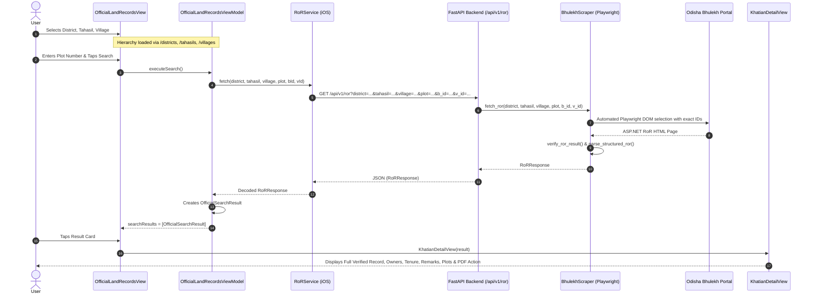
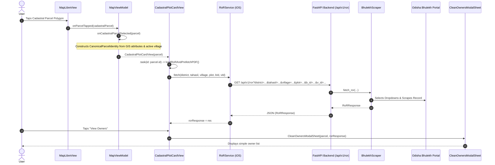
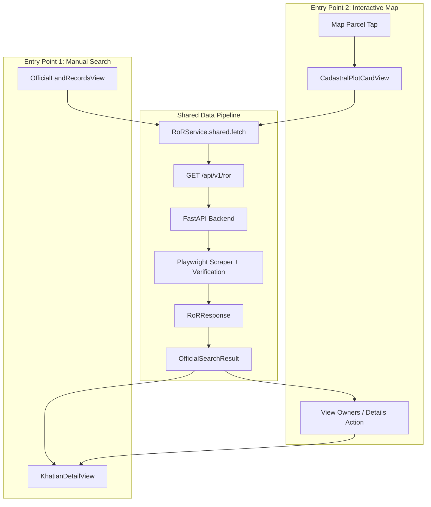

# Phase 4.01 — Manual vs Map RoR Audit

## Executive Summary
This audit evaluates the **Manual Record of Rights (RoR) Search** flow and the **Interactive Map Parcel Ownership** flow in the MyBhoomi codebase. The goal of this audit is to identify the precise differences between the two pipelines, determine why the manual flow operates with high reliability, and define the architectural blueprint to make the Map Parcel Ownership experience use the exact same data pipeline and response flow without altering backend behavior, breaking working code, or modifying source files during this audit phase.

---

## 1. Manual RoR Flow

### 1.1 Complete Architecture & Flow Trace
The Manual RoR search is a 4-tier hierarchical navigation system:
$$\text{District Selection} \rightarrow \text{Tahasil Selection} \rightarrow \text{Village Selection} \rightarrow \text{Plot / Khatian Input}$$



### 1.2 Exact Technical Specification of Manual RoR
- **SwiftUI Screen**: [`OfficialLandRecordsView.swift`](file:///Users/uday/Documents/MyBhoomi/MyBhoomi/Presentation/Views/OfficialLandRecordsView.swift) (along with [`KhatianDetailView.swift`](file:///Users/uday/Documents/MyBhoomi/MyBhoomi/Presentation/Views/KhatianDetailView.swift))
- **ViewModel**: [`OfficialLandRecordsViewModel.swift`](file:///Users/uday/Documents/MyBhoomi/MyBhoomi/Presentation/ViewModels/OfficialLandRecordsViewModel.swift)
- **Networking Service**: [`RoRService.swift`](file:///Users/uday/Documents/MyBhoomi/MyBhoomi/Services/RoRService.swift)
- **API Endpoint**: `GET /api/v1/ror`
- **Request Parameters**:
  - `district`: `d.officialName` (e.g., `"KEONJHAR"`)
  - `tahasil`: `t.officialName` (e.g., `"KEONJHAR SADAR"`)
  - `village`: `v.officialName` (e.g., `"G_Dimbo"` / `"Dimbo"`)
  - `plot`: `query` (e.g., `"489"`)
  - `b_id`: `t.id` (e.g., `"4"`)
  - `v_id`: `v.id` (e.g., `"179"`)
- **District ID**: Exact Bhulekh district code (e.g., `"7"`)
- **Tahasil ID**: Exact Bhulekh tahasil code (e.g., `"4"`)
- **Village ID**: Exact Bhulekh village code (e.g., `"179"`)
- **Village Name**: Official mapped village name from `/villages` endpoint
- **Block ID**: Tahasil code passed via `b_id`
- **Plot Number**: User-typed plot string (e.g., `"489"`)
- **Response Model**: [`RoRResponse`](file:///Users/uday/Documents/MyBhoomi/MyBhoomi/Domain/Models/RoRModels.swift#L66) wrapped inside [`OfficialSearchResult`](file:///Users/uday/Documents/MyBhoomi/MyBhoomi/Presentation/ViewModels/OfficialLandRecordsViewModel.swift#L19)
- **Owner Model**: `[OwnerEntry]` with properties:
  - `id`: UUID
  - `name`: Full Raiyat/Owner name
  - `share`: Share ratio / percentage (e.g. `"1/2"`)
  - `khataNumber`: Associated Khata number
- **Khata / Khatian**: `ror.khataNumber` (e.g., `"142"`)
- **Tenure**: `ror.landType` (or `ror.rawFields["tenure"]`, e.g., `"Sthitiban"`)
- **Tenant**: `ror.owners` or `ror.rawFields["tenant"]`
- **Thana**: `ror.rawFields["thana"]` or `ror.rawFields["ps_name"]`
- **RI Circle**: `ror.rawFields["ri_circle"]` or `ror.rawFields["circle"]`
- **Remarks**: `ror.rawFields["remarks"]`
- **PDF URL / Download**: [`OfficialRoRPDFService.swift`](file:///Users/uday/Documents/MyBhoomi/MyBhoomi/Services/OfficialRoRPDFService.swift) calling `GET /api/v1/ror/pdf` with SingleFlight coalescing, background prefetching, and disk caching via [`PDFDocumentManager.swift`](file:///Users/uday/Documents/MyBhoomi/MyBhoomi/Services/PDFDocumentManager.swift).
- **Loading State**: `viewModel.isSearching: Bool` showing `ProgressView("Searching official land records...")`
- **Error State**:
  - `isNoRecordFound: Bool` (Orange card for `RoRError.notFound` / `.identityMismatch`)
  - `searchError: String?` (Red card with "Try Again" button for `.timeout`, `.temporarilyUnavailable`, `.networkError`, `.serverError`)
- **Caching**:
  - Memory cache in `OfficialLandRecordsViewModel` for Tahasils (`tahasilCache: [String: [BhulekhTahasil]]`) and Villages (`villageCache: [String: [BhulekhVillage]]`).
  - Backend server cache (`TTLCache` with 24h TTL for verified records).
  - Disk document cache in `PDFDocumentManager`.

---

## 2. Map RoR Flow

### 2.1 Complete Architecture & Flow Trace
The Map RoR flow starts from user interaction on the MapLibre cadastral vector layer:
$$\text{Map Vector Tap} \rightarrow \text{CadastralParcel} \rightarrow \text{CanonicalParcelIdentity} \rightarrow \text{Parcel} \rightarrow \text{CadastralPlotCardView} \rightarrow \text{CleanOwnersModalSheet}$$



### 2.2 Exact Technical Specification of Map RoR
- **SwiftUI Screen**: [`CadastralPlotCardView.swift`](file:///Users/uday/Documents/MyBhoomi/MyBhoomi/Presentation/Views/CadastralPlotCardView.swift) (with legacy sheet [`ParcelDetailSheet.swift`](file:///Users/uday/Documents/MyBhoomi/MyBhoomi/Presentation/Views/ParcelDetailSheet.swift) still lingering in codebase)
- **ViewModel**: [`MapViewModel.swift`](file:///Users/uday/Documents/MyBhoomi/MyBhoomi/Presentation/ViewModels/MapViewModel.swift)
- **Networking Service**: [`RoRService.swift`](file:///Users/uday/Documents/MyBhoomi/MyBhoomi/Services/RoRService.swift)
- **API Endpoint**: `GET /api/v1/ror` (and `GET /api/v1/ror/pdf`)
- **Request Parameters**:
  - `district`: `parcel.identity.districtName`
  - `tahasil`: `parcel.identity.tahasilName`
  - `village`: `parcel.identity.villageName`
  - `plot`: `parcel.identity.plotNumber`
  - `b_id`: `parcel.identity.tahasilID`
  - `v_id`: `parcel.identity.villageID`
- **District ID**: `parcel.districtID` (often nil if tile omitted it, falls back to `"Keonjhar"`)
- **Tahasil ID**: `parcel.blockID` (often GIS block code e.g. `"0704"` instead of Bhulekh dropdown ID `"4"`)
- **Village ID**: `parcel.villageID` (often GIS village code e.g. `"0704179"` instead of Bhulekh village ID `"179"`)
- **Village Name**: `parcel.villageName` (e.g. `"G_Dimbo"`, `"G KERI 271"` from vector layer)
- **Plot Number**: `parcel.plotNumber` (e.g. `"489"`)
- **Response Model**: `RoRResponse` stored as `@State private var rorResponse: RoRResponse?`
- **Ownership Presentation**:
  - In `CadastralPlotCardView`: Peek summary pill + full snap view + [`CleanOwnersModalSheet`](file:///Users/uday/Documents/MyBhoomi/MyBhoomi/Presentation/Views/CadastralPlotCardView.swift#L808).
  - In legacy `ParcelDetailSheet`: Used `ParcelCrossVerifier.verify()` which attempted secondary client-side validation of area and text.
- **PDF URL / Download**: Handled via `OfficialRoRPDFService.shared.fetchOrGetPDF(...)`.

---

## 3. Side-by-Side Comparison

| Property | Manual RoR Flow | Map RoR Flow | Comparison & Analysis |
| :--- | :--- | :--- | :--- |
| **Trigger** | Explicit User Search button in `OfficialLandRecordsView` | Polygon Tap on map triggering `CadastralPlotCardView` | Map triggers automatically on parcel select |
| **District** | `BhulekhDistrict.officialName` (e.g. `"KEONJHAR"`) | `parcel.identity.districtName` (or `"Keonjhar"`) | Same string value |
| **Tahasil** | `BhulekhTahasil.officialName` (e.g. `"KEONJHAR SADAR"`) | `parcel.identity.tahasilName` (or `"Keonjhar Sadar"`) | Same string value |
| **Village** | `BhulekhVillage.officialName` (e.g. `"G_Dimbo"`) | `parcel.identity.villageName` (e.g. `"G_Dimbo"`) | Same string value |
| **Village ID** | Exact Bhulekh code (e.g. `"179"`) | GIS/Cadastral ID (e.g. `"0704179"` or `"179"`) | Manual has pre-resolved Bhulekh ID |
| **Block ID** | Exact Bhulekh Tahasil code (e.g. `"4"`) | GIS Block code (e.g. `"0704"` or `"4"`) | Manual has pre-resolved Bhulekh ID |
| **Plot** | User input string (e.g. `"489"`) | Vector feature plot (e.g. `"489"`) | Same plot identifier |
| **API Endpoint** | `GET /api/v1/ror` | `GET /api/v1/ror` | **Identical backend endpoint** |
| **Request Format** | Query params: `district, tahasil, village, plot, b_id, v_id` | Query params: `district, tahasil, village, plot, b_id, v_id` | **Identical query format** |
| **Backend Resolver** | `BhulekhScraper` + `BhulekhVillageResolver` | `BhulekhScraper` + `BhulekhVillageResolver` | **Identical backend resolver** |
| **Response Model** | `RoRResponse` $\rightarrow$ `OfficialSearchResult` | `RoRResponse` | Manual wraps in `OfficialSearchResult` |
| **Owner Parsing** | `ror.owners` (`[OwnerEntry]`) | `ror.owners` (`[OwnerEntry]`) | Identical owner list structure |
| **Thana** | `rawFields["thana"]` / `["ps_name"]` | `rawFields["thana"]` in full card snap | Identical data field |
| **RI Circle** | `rawFields["ri_circle"]` / `["circle"]` | `rawFields["ri_circle"]` in full card snap | Identical data field |
| **Tenant** | `ror.owners` or `rawFields["tenant"]` | `ror.owners` or `rawFields["landlord"]` | Identical data field |
| **Tenure** | `ror.landType` / `rawFields["tenure"]` | `ror.landType` / `rawFields["tenure"]` | Identical data field |
| **Remarks** | `rawFields["remarks"]` | `rawFields["remarks"]` in full card snap | Identical data field |
| **Associated Plots**| `ror.plots` (`[AssociatedPlot]`) | `ror.plots` in full card snap | Identical data field |
| **PDF Handling** | `OfficialRoRPDFService` + `PDFDocumentManager` | `OfficialRoRPDFService` + `PDFDocumentManager` | **Identical service & cache** |
| **Verification** | `RoRResponse.verification` (backend-verified) | `RoRResponse.verification` | Identical backend seal |
| **Ownership Detail UI** | [`KhatianDetailView`](file:///Users/uday/Documents/MyBhoomi/MyBhoomi/Presentation/Views/KhatianDetailView.swift) (Full official screen) | [`CleanOwnersModalSheet`](file:///Users/uday/Documents/MyBhoomi/MyBhoomi/Presentation/Views/CadastralPlotCardView.swift#L808) (Minimal popup) | **Major UI Divergence** |

---

## 4. Exact Difference

1. **Ownership Presentation Divergence**:
   - In **Manual RoR Search**, tapping a plot result presents [`KhatianDetailView`](file:///Users/uday/Documents/MyBhoomi/MyBhoomi/Presentation/Views/KhatianDetailView.swift). This screen provides the complete, authoritative record:
     - Official Verified Record seal pill
     - Complete Location Hierarchy (Khatian number, Village, Tahasil, District, Thana, RI Circle)
     - Tenant Section (Owner names, Share distributions, Tenure classification)
     - Remarks Section
     - Plots Section (All associated plots in the Khatian with areas and quick navigation)
     - Actionable Print / Download Official RoR PDF button
   - In **Map RoR Flow**, tapping "View Owners" presents [`CleanOwnersModalSheet`](file:///Users/uday/Documents/MyBhoomi/MyBhoomi/Presentation/Views/CadastralPlotCardView.swift#L808), which is a basic modal showing only owner names and shares. All the rich location details, Thana, RI Circle, Remarks, Associated Plots, and unified PDF controls from `KhatianDetailView` are omitted from the sheet.

2. **Entity Model Encapsulation Divergence**:
   - Manual RoR packages `RoRResponse` into an [`OfficialSearchResult`](file:///Users/uday/Documents/MyBhoomi/MyBhoomi/Presentation/ViewModels/OfficialLandRecordsViewModel.swift#L19) struct:
     ```swift
     public struct OfficialSearchResult: Identifiable, Equatable {
         public let districtID: String
         public let districtName: String
         public let tahasilID: String
         public let tahasilName: String
         public let villageID: String
         public let villageName: String
         public let plotNumber: String
         public let khatianNumber: String
         public let area: String?
         public let ownersCount: Int
         public let associatedPlots: [String]
         public let rawResponse: RoRResponse
     }
     ```
   - The Map Flow stores raw `RoRResponse?` directly inside `@State` on the view.

3. **Legacy Redundant Code**:
   - The codebase still contains [`ParcelDetailSheet.swift`](file:///Users/uday/Documents/MyBhoomi/MyBhoomi/Presentation/Views/ParcelDetailSheet.swift), [`ParcelCrossVerifier.swift`](file:///Users/uday/Documents/MyBhoomi/MyBhoomi/Services/ParcelCrossVerifier.swift), and [`ManualRoRSearchView.swift`](file:///Users/uday/Documents/MyBhoomi/MyBhoomi/Presentation/Views/ManualRoRSearchView.swift) from earlier iterations that duplicate logic and create confusion.

---

## 5. Why Manual RoR Is Faster & More Reliable

1. **Pre-Resolved Bhulekh Hierarchy IDs**:
   - In Manual RoR, the user explicitly picks District, Tahasil, and Village from `/districts`, `/tahasils`, and `/villages`.
   - The client passes `b_id = "4"` and `v_id = "179"` directly.
   - On the backend, `BhulekhScraper` immediately selects the exact dropdown option `<option value="179">` in 1 step without running regex matching or falling back through resolution heuristics.

2. **Map Identity Variations**:
   - On the Map, vector tile attributes often provide GIS-scoped codes (e.g. `block_id: "0704"`, `village_id: "0704179"`, or village name `"G_Dimbo"`).
   - The backend must invoke `BhulekhVillageResolver` to cross-reference aliases, bilingual tables, and catalog mappings before selecting the dropdown.
   - When `activeCadastralVillage` is active, however, the pre-resolved hierarchy can be supplied directly.

3. **No Unnecessary Local Redundancy**:
   - Manual RoR relies purely on the authoritative backend verification status `ror.verification.status == .verified`.
   - It avoids client-side acreage tolerance parsing or fuzzy string comparison.

---

## 6. Recommended Architecture

### 6.1 Unified Shared Pipeline Design
To make the Map ownership experience use the **EXACT SAME** RoR pipeline and response flow:

1. **Reuse `OfficialSearchResult` & `KhatianDetailView`**:
   - When RoR data is fetched for a map parcel, construct an `OfficialSearchResult` from the parcel's `CanonicalParcelIdentity` and the returned `RoRResponse`.
   - When the user taps "View Owners" (or taps to view legal ownership detail) on the Map card, present [`KhatianDetailView(result: officialResult)`](file:///Users/uday/Documents/MyBhoomi/MyBhoomi/Presentation/Views/KhatianDetailView.swift).
   - This instantly guarantees 100% feature parity: exact same verification badge, location table (Thana, RI Circle), tenant list with shares & tenure, remarks, related plots, and background PDF caching.

2. **Standardize Request Construction**:
   - Both flows must invoke the exact same method:
     ```swift
     RoRService.shared.fetch(
         district: identity.districtName,
         tahasil: identity.tahasilName,
         village: identity.villageName,
         plot: identity.plotNumber,
         bId: identity.tahasilID,
         vId: identity.villageID
     )
     ```
   - In `MapViewModel.onCadastralParcelSelected`, ensure that if `activeCadastralVillage` is loaded, its official Bhulekh IDs (`districtID`, `tahasilID`, `villageID`) are attached to `CanonicalParcelIdentity`.



---

## 7. Files That Need Changing (During Implementation Phase)

1. [`MyBhoomi/Presentation/Views/CadastralPlotCardView.swift`](file:///Users/uday/Documents/MyBhoomi/MyBhoomi/Presentation/Views/CadastralPlotCardView.swift):
   - Replace `CleanOwnersModalSheet` presentation with `KhatianDetailView(result: officialSearchResult)`.
   - Store `officialSearchResult: OfficialSearchResult?` constructed from `rorResponse`.
2. [`MyBhoomi/Presentation/ViewModels/MapViewModel.swift`](file:///Users/uday/Documents/MyBhoomi/MyBhoomi/Presentation/ViewModels/MapViewModel.swift):
   - In `onCadastralParcelSelected`, ensure `districtID`, `tahasilID`, and `villageID` from `activeCadastralVillage` are forwarded if parcel vector attributes lack them.

---

## 8. Files That Must NOT Be Changed

1. **Backend Code**:
   - `BhulekBackend/routers/ror.py`
   - `BhulekBackend/services/ror_service.py`
   - `BhulekBackend/scrapers/bhulekh_scraper.py`
   - `BhulekBackend/resolvers/bhulekh_identity_resolver.py`
   *(Backend is already shared, robust, rate-limited, and verified.)*
2. **Manual RoR Search**:
   - `MyBhoomi/Presentation/Views/OfficialLandRecordsView.swift`
   - `MyBhoomi/Presentation/ViewModels/OfficialLandRecordsViewModel.swift`
   *(Manual RoR works quickly and correctly; must remain unchanged.)*
3. **Core Networking & PDF Services**:
   - `MyBhoomi/Services/RoRService.swift`
   - `MyBhoomi/Services/OfficialRoRPDFService.swift`
   - `MyBhoomi/Services/PDFDocumentManager.swift`
4. **Domain Models**:
   - `MyBhoomi/Domain/Models/RoRModels.swift`

---

## 9. Risk Assessment

| Risk | Severity | Mitigation |
| :--- | :--- | :--- |
| **Parcel Vector ID Mismatch** | Low | If `parcel.districtID` / `villageID` is missing from GIS vector tiles, fallback to `activeCadastralVillage` IDs ensures Bhulekh codes are present. |
| **Modal Sheet Hierarchy Conflicts** | Low | `KhatianDetailView` has its own `NavigationView` and dismiss button, designed specifically for clean modal presentation over sheets. |
| **PDF Request Duplication** | Low | `OfficialRoRPDFService` uses SingleFlight coalescing and disk caching, preventing duplicate downloads. |

---

## 10. Answers to Specific Audit Questions

1. **Are both flows already calling the same backend endpoint?**
   **Yes.** Both flows call `GET /api/v1/ror` (and `GET /api/v1/ror/pdf` for documents).
2. **If not, which endpoint does each use?**
   N/A (both use `GET /api/v1/ror`).
3. **Why does Manual RoR feel faster?**
   Because Manual RoR selects from `/villages` beforehand, passing exact numeric Bhulekh dropdown IDs (`b_id`, `v_id`). The backend scraper can select the dropdown in 1 step without resolving name aliases.
4. **Is the manual flow using a cached/pre-resolved village identity?**
   **Yes.** The user picks from the pre-resolved `BhulekhVillage` list returned by `/villages`.
5. **Is the map flow performing additional verification or translation work?**
   The active map card (`CadastralPlotCardView`) does not perform extra translation, but the legacy `ParcelDetailSheet` performed extra client-side cross-verification. On the backend, if vector names differ slightly from Bhulekh Mouza names, the backend performs 6-level resolution.
6. **Is the map flow doing unnecessary network calls?**
   `CadastralPlotCardView` automatically starts PDF prefetching on card appear. When tapping a parcel, it fires both RoR data fetch and background PDF prefetch simultaneously.
7. **Is the map flow translating Odia → English unnecessarily?**
   **No.** Both flows receive the same structured `RoRResponse` from the backend.
8. **Can the map flow reuse the manual RoR response model directly?**
   **Yes.** `RoRResponse` and `OfficialSearchResult` can be used directly.
9. **Can the map flow reuse the exact same service method?**
   **Yes.** `RoRService.shared.fetch(district:tahasil:village:plot:bId:vId:)`.
10. **What is the smallest safe architectural change needed?**
    Have `CadastralPlotCardView` construct an `OfficialSearchResult` upon receiving `RoRResponse` and present `KhatianDetailView(result: ...)` when the user taps "View Owners", matching the manual search experience with zero backend changes and zero modifications to the working manual search.

---

## Pipeline Summary

### CURRENT MANUAL ROR PIPELINE:
```text
OfficialLandRecordsView
  └── OfficialLandRecordsViewModel.executeSearch()
        └── RoRService.shared.fetch(district, tahasil, village, plot, bId, vId)
              └── GET /api/v1/ror?district=...&tahasil=...&village=...&plot=...&b_id=...&v_id=...
                    └── BhulekhScraper._execute_scrape() (Playwright + verify_ror_result)
                          └── RoRResponse -> OfficialSearchResult
                                └── KhatianDetailView(result: OfficialSearchResult)
```

### CURRENT MAP ROR PIPELINE:
```text
MapLibreView (onParcelTapped)
  └── MapViewModel.onCadastralParcelSelected(parcel)
        └── CadastralPlotCardView (loadRoRAndPrefetchPDF)
              └── RoRService.shared.fetch(district, tahasil, village, plot, bId, vId)
                    └── GET /api/v1/ror?district=...&tahasil=...&village=...&plot=...&b_id=...&v_id=...
                          └── RoRResponse stored in @State
                                └── CleanOwnersModalSheet(parcel, rorResponse) [Simplified Modal]
```

### RECOMMENDED SHARED PIPELINE:
```text
[Manual Search / Map Parcel Tap]
  └── RoRService.shared.fetch(district, tahasil, village, plot, bId, vId)
        └── GET /api/v1/ror?district=...&tahasil=...&village=...&plot=...&b_id=...&v_id=...
              └── BhulekhScraper (Authoritative Server Verification)
                    └── RoRResponse -> OfficialSearchResult
                          └── KhatianDetailView(result: OfficialSearchResult)
```
