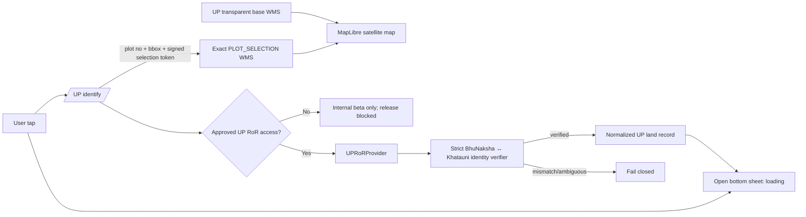

# Uttar Pradesh Exact Parcel Selection and RoR Integration Plan

## Problem Statement

The current UP prototype proves that Uttar Pradesh BhuNaksha parcel maps can be aligned with the app's satellite map and that a map tap can identify a plot. Its visual behavior is not yet acceptable: the base WMS tile contains a beige cadastral-map background, and the selected plot is represented by a yellow bounding rectangle that can cover several neighbouring parcels.

The required product flow is:

1. Show a simplified, transparent cadastral layer containing parcel borders and plot numbers over the satellite map.
2. When the user taps a parcel, select only that exact parcel shape, as the official UP BhuNaksha website does.
3. Open the bottom sheet immediately and load the complete, identity-verified official UP RoR/Real-Time Khatauni for that parcel.
4. Present all available record fields with the same quality and clarity as the Odisha experience.

The map portion is technically feasible through public WMS endpoints now. Complete seamless RoR retrieval remains a release blocker because the documented record endpoints require an authorization token and encrypted identifiers; the public unauthenticated bridge is not reliable.

## Requirements

### Map and selection

- Keep satellite imagery visible.
- Display only the official parcel borders and plot numbers; remove the beige cadastral fill/background.
- Preserve the official alignment and labels rather than tracing approximate client-side polygons.
- A tap must identify one plot and highlight only that exact plot—not its bounding rectangle.
- A second tap must clear the first highlight immediately; stale requests must never restore an earlier selection.
- Plot-number search must use the same exact-selection treatment.
- The selection overlay must disappear on village change, UP exit, remote disablement and MapLibre style reload.
- While UP mode is active, the top location/search control must say `Uttar Pradesh` (or `UP`) instead of `Odisha`; tapping `Search village` must reopen the UP village picker rather than the Odisha search flow.
- Keep the returned plot bbox only for camera fitting; never represent it as the parcel boundary.

### Record flow

- The bottom sheet appears as soon as a plot is tapped, initially in a loading state.
- The selected BhuNaksha identity (`district + tehsil + village + gisCode + plot number + plot ID`) must be bound to the RoR request.
- A full record is shown only after the returned official identity matches the selected parcel identity.
- The final record should include every field the approved official response supplies, including:
  - Khata/Khatauni and Gata/plot numbers;
  - current recorded owners/tenure holders;
  - relation/guardian details, shares and residence when present;
  - plot area and units;
  - land category/classification and tenure;
  - rent/revenue/cess when present;
  - associated plots in the Khata;
  - remarks, orders and mutation references when present;
  - record year, source reference and retrieval time.
- Multiple Khatas or subdivided Gatas are displayed as separate sections in the same sheet.
- Missing or ambiguous identity fails closed; no unrelated record is shown.
- UP remains free during the prototype; do not deduct Odisha plot credits.

### Access and compliance

- Public portals and approved official APIs only.
- Never automate, solve, suppress or bypass CAPTCHA.
- Do not forge or reverse-engineer an authorization token.
- If the Board of Revenue does not grant approved API access, UP must remain an internal beta and cannot be released as a complete-RoR feature.
- Plain online Khatauni must be labelled informational; the app must not imply it is a certified copy.
- Keep the UP server environment kill switch and the app-config discovery switch.

### Privacy and security

- Never write owner names, guardian names, residences, raw RoR payloads or document bodies to logs, analytics, crash metadata or diagnostic strings.
- Complete UP RoR responses use `Cache-Control: private, no-store`.
- Use an ephemeral/no-cache iOS URLSession for owner-record calls.
- Do not store UP owner data in `VerifiedParcelCache` or PDF caches during the prototype.
- Keep only the normalized response in memory for the life of the open sheet; clear it on dismissal, village change and UP exit.
- Selection tokens contain no owner information and expire quickly.

### Odisha isolation and quality

- Do not route UP through Odisha `RoRService`, `BhulekhScraper`, identity resolver, area formatter or government-land heuristics.
- Use only `up-*` MapLibre source/layer IDs.
- UP changes must leave Odisha map, tap, GPS, search, credit, RoR and PDF behavior unchanged.
- Debug and Release iOS device builds must pass; the existing UP and Odisha map lifecycle suites must continue to pass on the physical iPhone.

## Background

### Current UP prototype

The current backend is isolated in:

- `BhulekBackend/providers/up_bhunaksha_provider.py`
- `BhulekBackend/routers/up_gis.py`
- `BhulekBackend/models/up_gis.py`

It provides hierarchy, georeferenced village extents, plot identification, plot-number search and proxied WMS tiles. It already validates UP bounds, limits upstream concurrency and response size, coalesces duplicate tiles, uses a byte-budgeted cache and drops owner rows from the current basic `getPlotInfo` response.

The current iOS implementation is isolated in:

- `MyBhoomi/Services/GIS/UPMapService.swift`
- `MyBhoomi/Presentation/ViewModels/MapViewModel+UP.swift`
- `MyBhoomi/Presentation/Views/UPVillagePickerSheet.swift`
- `MyBhoomi/Presentation/Views/UPPlotCard.swift`
- `MyBhoomi/Map/MapLibre/MapLibreView.swift`

`MapLibreView.syncUPLayers` currently creates one raster village layer, then creates an `MLNShapeSource` rectangle from `UPPlotResult.bbox`. That rectangle is the large dashed yellow box visible in the device screenshot; it is not an exact parcel boundary.

### Confirmed official map behavior

Static inspection of the public [UP BhuNaksha application](https://upbhunaksha.gov.in/) shows that the official website also uses WMS images, not public client-side parcel vectors, for this interaction:

- Simplified base map: `/WMS/tile`, `LAYERS=VILLAGE_MAP`, `STYLES=VILLAGE_MAP_TRANSPARENT`, `TRANSPARENT=true`.
- Exact selected plot: `/WMS`, `LAYERS=PLOT_LIST`, `STYLES=PLOT_SELECTION`, `gis_code=<village>`, `plot_id=<selected plot ID>`.

The website's map-tap flow calls `getPlotAtXY`, receives the plot number and opaque plot ID, and updates a separate selected-plot WMS layer. Live checks returned valid RGBA PNGs for both the transparent base and exact selection. The existing Bhumitra identify response already carries the required `plot_id` end to end.

This is preferable to raster-to-vector tracing: it preserves the official parcel geometry and exactly reproduces the website's selection semantics.

### Confirmed official RoR surface

The official [UP PublicBhuApi OpenAPI specification](https://upbhulekh.gov.in/PublicBhuApi/v3/api-docs) documents operations for Gata lookup, current RoR, owner details, associated data, remarks, orders and BhuNaksha-to-Khatauni linking. The relevant operations include `/api/gata_seq`, `/api/rorPresent`, `/api/ror`, `/api/getOwnerDetails`, `/api/remarks`, `/api/getkayr`, `/api/specialOrd`, `/bhunaksha/plots` and `/bhunaksha/khatauni_plots`.

However:

- Complete-record operations require an explicit `Authorization` header and encrypted/opaque location identifiers.
- The OpenAPI success responses are generic objects/strings rather than stable typed record schemas.
- The two unauthenticated BhuNaksha bridge endpoints failed to return any response within 120 seconds from both the Mac and the Mumbai EC2 host.
- The public Real-Time Khatauni journey includes user CAPTCHA challenges.
- The official [GeoDashboard](https://upbhulekh.gov.in/GeoDashboard/) confirms broad linkage between Khatauni and BhuNaksha villages, but does not provide a reliable complete-record API contract.

The National Informatics Centre describes [BhuNaksha](https://www.nic.gov.in/project/bhunaksha/) as a cadastral system designed for state land-record integration, which supports seeking an approved UP-specific PublicBhuApi integration rather than reverse-engineering the public UI.

### Existing Odisha presentation architecture

`CadastralPlotCardView` provides the desired visual language: immediate skeleton, verified identity state, summary metrics, expandable owners and a full land-record report. Its acquisition path is Odisha-specific and must not be reused directly. The reusable target is its presentation structure—not its Odisha resolver, service, formatter, analytics or cache.

## Proposed Solution



### Exact map design

Use the official WMS styles through fixed-purpose backend methods. The client never controls upstream path, layer, style, CRS or format.

1. **Base tiles**
   - Upstream: `/WMS/tile` with `VILLAGE_MAP_TRANSPARENT`.
   - Public Bhumitra route: `/api/v1/gis/up/wms/base/{gis_code}`.
   - Cache: public, one hour, byte-budgeted base-tile partition.
   - Keep `/wms/{gis_code}` temporarily as a compatibility alias, but make it transparent too.

2. **Selection tiles**
   - Upstream: `/WMS` with `PLOT_LIST + PLOT_SELECTION + plot_id`.
   - Public Bhumitra route: `/api/v1/gis/up/wms/selection/{selection_token}`.
   - The identify/plot endpoint returns a five-minute HMAC token bound to version, expiry, `gis_code` and validated `plot_id`.
   - Cache: private, five minutes, separate smaller byte budget so selections cannot evict the base map.
   - Validate PNG MIME, signature and IHDR dimensions before caching.

3. **iOS layers**
   - `up-wms-layer`: transparent borders and plot labels over satellite.
   - `up-selection-wms-layer`: exact official selected parcel above the base UP layer.
   - Remove the current `up-selected-source`, fill and dashed rectangle.
   - Preserve bbox only for fitting the camera after plot-number search.

### Selection state design

Introduce a small state machine rather than using only `selectedUPPlot`:

```text
idle
identifying(requestID, coordinate)
identified(requestID, plot result, selection token)
loadingRecord(requestID, plot result)
recordReady(requestID, verified UP record)
failed(requestID, retryable error)
```

Every tap generates a request ID. Results update the UI only if the request ID and active village still match. A new tap clears the old selection raster synchronously and opens the loading sheet immediately.

### Complete RoR design

Do not adapt incomplete `MapInfo/getPlotInfo` into a complete record. Once approved PublicBhuApi access is available:

- Add a dedicated `UPRoRProvider` and `UPRoRIdentityVerifier`.
- Resolve BhuNaksha `gisCode + plot number` to the official Real-Time Khatauni identity.
- Acquire and refresh the approved authorization token exactly as documented by the authority.
- Fetch current RoR, owner details, associated plots, remarks and orders.
- Parse state-specific payloads into `UPRoRResponse`.
- Adapt that into a jurisdiction-neutral `LandRecordDisplayModel` used only by shared UI components.
- Keep raw payloads out of logs and persistent caches.
- Return a record only after strict district, tehsil, village and Gata matching.

If approved access is not granted, the map can remain an internal engineering prototype, but the UP feature must not be enabled for Release users.

## Task Breakdown

## Phase 1 — Website-style exact parcel map

### Task 1: Lock the official WMS contracts with fixtures

**Objective:** Convert the observed website behavior into deterministic backend contracts before changing production routes.

**Work:**
- Add sanitized base-tile and selection-tile PNG fixtures captured from non-sensitive map requests.
- Document the fixed upstream parameter sets in the provider tests.
- Record the observed `plot_id` character grammar and reject anything outside it.
- Add a style version constant such as `UP_MAP_STYLE_VERSION = "transparent-selection-v1"`.

**Testing:**
- Assert the base request uses only `/WMS/tile + VILLAGE_MAP_TRANSPARENT`.
- Assert selection uses only `/WMS + PLOT_LIST + PLOT_SELECTION`.
- Assert both fixtures are PNG, use expected dimensions, and differ from one another.
- Assert no owner/RoR content is involved in map-tile requests.

**Demo:** A provider-level test prints only route/style metadata and confirms valid independent base/selection images.

### Task 2: Add signed exact-selection capability

**Objective:** Allow the app to request an exact plot-selection image without exposing an arbitrary upstream `plot_id` proxy.

**Work:**
- Add `UP_SELECTION_TOKEN_SECRET` to `core/config.py`; require a production value whenever the UP provider is enabled.
- Create a compact HMAC-SHA256 selection capability containing version, expiry, `gis_code` and validated `plot_id`.
- Add `selection_token` and `selection_expires_at` to `UPPlotResult`.
- Mint the token only after successful `getPlotAtXY` or `getPlotByPlotNo` identity.
- Verify token signature/expiry before any selected-layer upstream request.
- Do not place plot number, owner information or location names in the token.

**Testing:**
- Valid token succeeds for the bound plot/village.
- Tampered, expired, malformed, wrong-village and wrong-plot tokens fail before upstream access.
- A valid token survives both Gunicorn workers without process-local state.
- Token contents and logs contain no personal record data.

**Demo:** Identify a known test point, receive a token, fetch one exact-selection PNG, then show a tampered token returning a controlled 401/422.

### Task 3: Split and harden base/selection WMS proxies

**Objective:** Deliver transparent base parcels and exact selected parcels with independent resource controls.

**Work:**
- Change base fetching to `/WMS/tile` and `VILLAGE_MAP_TRANSPARENT`.
- Add selection fetching using `/WMS`, `PLOT_LIST`, `PLOT_SELECTION` and token-bound plot ID.
- Namespace cache/in-flight keys by purpose, style version, village, plot, size and bbox.
- Keep 24 MB/one-hour base cache; add an approximately 8 MB/five-minute selection cache.
- Validate upstream content type, PNG signature, IHDR dimensions and response byte cap.
- Add `/wms/base/{gis_code}` and `/wms/selection/{token}` routes.
- Retain existing `/wms/{gis_code}` as a temporary transparent-base alias.
- Keep fixed upstream host/path/style parameters and existing per-client/global rate budgets.

**Testing:**
- Base, selection and plot-A/plot-B cache entries cannot collide.
- Concurrent identical requests coalesce; distinct selections do not.
- Wrong MIME, dimensions, oversized body and malformed PNG fail closed.
- Both routes return 503 when `UP_GIS_PROVIDER_ENABLED=false`.
- Base response is public-cacheable; selection response is private and short-lived.

**Demo:** Compare current opaque tile, new transparent base tile and exact selected tile for the same village/plot.

### Task 4: Replace the iOS rectangle with an exact selected WMS layer

**Objective:** Reproduce the official website selection behavior in MapLibre.

**Work:**
- Decode `selection_token` in `UPPlotResult`.
- Add `UPMapService.selectionTileURLTemplate(token:)`.
- Replace `upSelectedBBox` in `MainView`/`MapLibreView` with `upSelectionTileURLTemplate`.
- Remove the rectangle `MLNShapeSource` and dashed fill/line layers.
- Add `up-selection-wms-source` and `up-selection-wms-layer` above `up-wms-layer`.
- Replace/remove the source on token changes, nil, village changes, UP exit and style reload.
- Make `MapHomeOverlay`/the location selector jurisdiction-aware: show `Uttar Pradesh` in UP mode and route its search action to `UPVillagePickerSheet`; preserve the current Odisha behavior outside UP mode.
- Keep plot bbox for camera fitting only.
- Use the base raster at full opacity because the source itself is transparent; tune selected-layer opacity to retain satellite context.

**Testing:**
- Swift decoding covers present/missing selection tokens.
- Layer lifecycle tests cover add, replace, remove and style reload.
- Selection A cannot remain visible after selection B starts.
- Missing/expired token displays plot details without an inaccurate rectangle.
- Existing Odisha source/layer identifiers and hit testing remain unchanged.

**Demo:** On the connected iPhone, tap adjoining plots and verify only the touched official polygon is highlighted each time.

### Task 5: Make tap and plot search race-safe

**Objective:** Ensure rapid interaction always displays the latest exact parcel.

**Work:**
- Add a monotonically changing request generation/UUID to UP selection state.
- Clear current selection synchronously at the start of each tap/search.
- Apply identify, selection-token, busy/error and sheet updates only when request ID and `gisCode` still match.
- Cancel/invalidate requests on village switch, UP exit and feature disablement.
- Preserve the original Odisha return snapshot when switching from one UP village to another; do not overwrite it with the current UP camera.

**Testing:**
- Slow tap A followed by fast tap B ends on B.
- Village A response cannot affect village B.
- Dismissing the sheet during lookup cannot reopen it.
- UP-to-UP village switch followed by Exit restores the original Odisha context.

**Demo:** Rapidly tap several adjacent parcels and switch villages during a pending lookup without stale overlays or sheets.

### Task 6: Phase 1 device demonstration

**Objective:** Sign off the exact map experience before any RoR-access work is treated as product-ready.

**Work:**
- Deploy behind existing server/app flags; keep `up_map_enabled=false` for Release.
- Install the Debug build on the iPhone 14.
- Test at least five villages across geographically separated districts.

**Testing and acceptance:**
- Transparent satellite-visible base in 5/5 villages.
- Top selector correctly says `Uttar Pradesh`; `Search village` changes the UP village without entering the Odisha search flow.
- Plot numbers remain readable.
- 20 representative taps highlight one exact official polygon, not a bbox.
- Median identify-to-highlight target: under 1.5 seconds on normal connectivity.
- Pan/zoom remains smooth; no orphaned tiles after selection/village changes.
- UP + Odisha lifecycle tests pass on the physical device.

**Demo:** Side-by-side screen recording of the official website and Bhumitra selecting the same test plot.

## Phase 2 — Official complete-RoR access gate

### Task 7: Prepare and submit the official PublicBhuApi access package

**Objective:** Obtain authorized, documented service access suitable for production use.

**Work:**
- Prepare a concise integration request for the UP Board of Revenue/NIC containing:
  - app/company identity and public-purpose use case;
  - exact desired flow (`gisCode/Gata → Real-Time Khatauni`);
  - documented endpoint list;
  - estimated prototype/production request volume;
  - no scraping/CAPTCHA bypass commitment;
  - rate limiting, no-store PII policy and attribution;
  - staging IP/domain and contact details;
  - request for sandbox/test identities and typed field documentation.
- Request clarification on display/republication rights for owner information and plain versus certified Khatauni.
- Store any resulting credential only in AWS SSM Parameter Store or Secrets Manager; never in git or chat.

**Testing/acceptance:**
- Written approval or API terms are available.
- A test token can be obtained through an approved mechanism.
- Token lifecycle, quota and permitted fields are documented.
- At least one sanctioned test identity is supplied or approved.

**Demo:** A redacted capability report showing only endpoint status, response keys and token expiry—no record values.

**Hard gate:** Do not start Tasks 8–12 without satisfying this task. If access is denied or requires automated CAPTCHA circumvention, UP remains internal-only.

### Task 8: Build the approved UP RoR acquisition adapter

**Objective:** Retrieve complete current Khatauni data through the approved PublicBhuApi flow.

**Work:**
- Add `services/up_ror_service.py` and `providers/up_bhulekh_provider.py` rather than modifying Odisha services.
- Implement approved token acquisition/refresh and encrypted identifier handling from official documentation.
- Map BhuNaksha district/tehsil/village codes to PublicBhuApi census codes.
- Fetch Gata sequence, current RoR, owner details, associated plots, remarks and order/mutation data using only permitted operations.
- Bound concurrency, queue depth, response sizes and total timeout separately from Odisha Playwright.
- Maintain only non-PII hierarchy/identity caches; do not cache raw owner responses.

**Testing:**
- Use sanitized real-shaped fixtures for simple, multiple-owner, multiple-Khata, fractional/subdivided Gata, government land, missing fields and Unicode cases.
- Token expiry/refresh, quota, timeout and upstream-format errors return structured retryable/nonretryable errors.
- Cross-village and cross-Gata cache leakage is impossible.
- Raw payloads and owner values never appear in logs.

**Demo:** Retrieve a sanctioned test record and output only normalized field names/counts and verification status.

### Task 9: Normalize and verify UP RoR identity

**Objective:** Ensure the displayed RoR belongs to the exact parcel selected on the map.

**Work:**
- Define `UPRoRResponse`, `UPOwnerEntry`, `UPAssociatedPlot`, `UPRemark`, `UPOrderReference` and provenance models.
- Add a jurisdiction-neutral `LandRecordDisplayModel` adapter for UI reuse.
- Implement strict matching across district, tehsil, village code, Gata/plot normalization and returned Khata associations.
- Treat multiple legitimate Khatas/sub-plots as explicit sections, not ambiguity to silently collapse.
- Require a verified source timestamp/reference and identity evidence in every successful result.

**Testing:**
- Exact, normalized fraction/suffix and multi-Khata cases verify.
- Wrong village, wrong Gata, missing identity and conflicting source records fail closed.
- No UP Hindi terminology is passed through Odisha name/area/government-land formatters.

**Demo:** Show one verified multi-owner/multi-plot normalized fixture and several rejected mismatch fixtures.

### Task 10: Add the complete UP RoR backend endpoint

**Objective:** Expose one safe app-facing operation for selected parcel → complete verified record.

**Work:**
- Add `GET /api/v1/gis/up/ror?selection_token=...` or a POST body containing the short-lived selection capability.
- Verify the map selection token before contacting PublicBhuApi.
- Require app authentication if owner data policy requires it, but do not charge credits during prototype.
- Set `Cache-Control: private, no-store`, `Pragma: no-cache` and appropriate content-security headers.
- Return normalized structured errors for access unavailable, record not found, identity mismatch, token expiry, upstream busy and schema change.
- Add a separate RoR global queue/rate budget to protect the official service.

**Testing:**
- Disabled flag, expired/tampered token and identity mismatch make zero record calls.
- Owner PII does not enter access logs, structured logs, metrics, diagnostics or exceptions.
- Preview/basic BhuNaksha response is never returned as a complete RoR.
- Odisha `/ror` behavior and quota accounting remain unchanged.

**Demo:** One authorized test token produces one complete verified normalized response through Bhumitra; a tampered selection fails closed.

## Phase 3 — Odisha-quality bottom sheet and release validation

### Task 11: Build the UP complete-record bottom sheet

**Objective:** Deliver the required tap → loading sheet → complete RoR experience.

**Work:**
- Open a UP-specific sheet immediately on tap using the selection state machine.
- Reuse/extract presentation-only components from `CadastralPlotCardView`: loading skeleton, summary tiles, owner expansion, detail sections and retry states.
- Keep acquisition and formatting state-specific; do not instantiate Odisha `RoRService`.
- Display:
  - exact selected plot and village identity;
  - verification/provenance badge;
  - Khata/Gata/area/classification summary;
  - all owners and relationships;
  - associated plots grouped by Khata;
  - remarks/orders/mutation/reference sections;
  - retrieval time and informational/non-certified disclaimer.
- Use an ephemeral URLSession and clear record state on dismissal.
- Do not save or download records in the first UP release.

**Testing:**
- Swift decoding for all fixture shapes and missing fields.
- Loading, verified, multiple-Khata, not-found, mismatch, expired-token, busy and retry states.
- Large owner sets, Hindi text, Dynamic Type and VoiceOver.
- Rapid tap cancellation cannot show the previous plot's owners.
- Encoded diagnostics and analytics contain no names, addresses or raw payload.

**Demo:** On-device sanctioned test record shown in the bottom sheet with all sections, then dismissed with no persistence.

### Task 12: Release-gate validation and staged rollout

**Objective:** Enable UP only when it meets the non-negotiable flow and does not weaken Odisha.

**Work:**
- Run a sanctioned matrix across at least 5 districts and 20 villages covering different record shapes.
- Validate map-to-record identity for at least 50 plots.
- Run daily capability/contract monitoring for WMS, selection and approved RoR endpoints.
- Keep independent server switches for UP map and UP RoR; keep app-config off until final sign-off.
- Document rollback: disable app-config first, then UP RoR env flag, then map env flag if needed.

**Testing and acceptance:**
- Transparent base and exact selected polygon: 50/50 valid plots.
- Complete verified RoR: target 95%+ of official records that are available on the portal; every failure is explicit and never substitutes unrelated data.
- Zero owner-data leakage in logs/cache/analytics audits.
- Physical iPhone tests, Debug build and Release build pass.
- Existing Odisha backend suite and map/RoR device suites pass unchanged.
- Product owner manually approves the full tap-to-RoR journey.

**Demo:** Final end-to-end recording: choose UP village → see transparent parcel map → tap exact parcel → exact highlight → complete verified RoR sheet → switch parcel → exit to restored Odisha context.

## Testing Strategy Summary

Testing is embedded in each task rather than deferred to one broad final phase:

- **Backend unit/contract tests:** fixed WMS parameters, token security, cache isolation, response validation and strict RoR parsing.
- **Backend integration tests:** authorized PublicBhuApi flow with sanitized fixtures and controlled live sanctioned identities.
- **iOS model/state tests:** decoding, request-generation ordering, selection lifecycle, UP-to-UP/UP-to-Odisha transitions and privacy.
- **Map rendering tests:** transparent base and exact selected WMS fixture checks plus physical-device visual verification.
- **Regression tests:** existing Odisha search, GPS, map layer, RoR, credits and PDF flows.
- **Operational tests:** feature disablement, token expiry, queue pressure, upstream outage and rollback.

## Demo Milestones

1. **Exact map demo:** transparent borders/numbers and exact official selected plot on the connected iPhone.
2. **Approved-access demo:** redacted field/schema proof from sanctioned PublicBhuApi access.
3. **Complete record demo:** one verified UP RoR rendered in the polished bottom sheet.
4. **Release candidate demo:** multi-district end-to-end flow plus Odisha regression and kill-switch demonstration.

## Final Go/No-Go Rule

- **Go for internal Phase 1 now:** exact website-style map experience is confirmed technically feasible.
- **No-Go for public UP release today:** complete seamless RoR access is not yet authorized/reliable.
- **Go for public release only after:** approved PublicBhuApi access, strict identity verification, complete bottom-sheet records, privacy audit and the Task 12 acceptance matrix all pass.

Content from external sources was rephrased for compliance with licensing restrictions.
